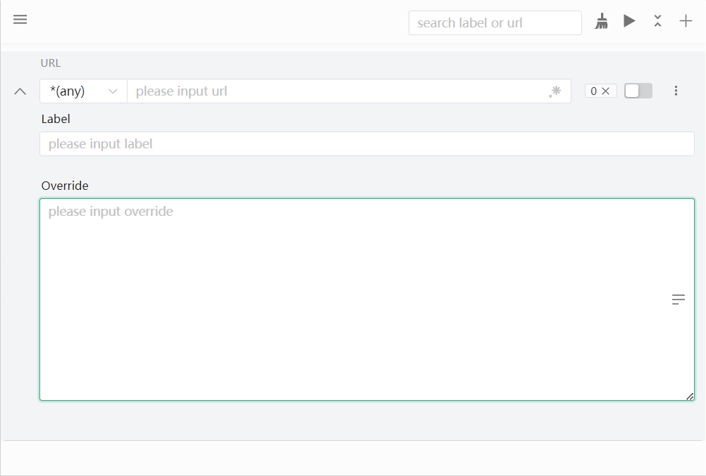

# Colibri

Ajax proxy v2 版本，基于前一代的沉淀，汇总了工作中发现的一些问题和优化项。因为 [v1](https://github.com/g0ngjie/ajax-proxy) 版本已经上架很久了。考虑到用户操作习惯，只能在不影响功能的前提下做小优化。

基于此重新开发了这一套工具，在原有功能的基础上做大幅度的优化。

期间也参考了很多优秀的开源项目：[devtools](https://github.com/vuejs/devtools)、[ajax-hook](https://github.com/wendux/ajax-hook) 等，UI 风格参考 tweak。

项目也从原来的单一架构调整为 Pnpm Monorepo。主要技术栈 Vue3 + Tsx + Vite2 + NaiveUI。

此项目仅为学习，目前关于 Manifest V3 版本的相关的问题比较多。如果你有任何关于浏览器插件开发方面的疑惑，并在我这里找到了答案，不胜荣幸！

### 对比 [Ajax Proxy](https://github.com/g0ngjie/ajax-proxy) 做出的优化

|          | Ajax Proxy | Colibri  |
| -------- | ---------- | -------- |
| 打包体积 | 2.19MB     | 660KB    |
| 生效条件 | 需要刷新   | 即时响应 |
| 协议拦截 | 不支持     | 支持     |

## Monorepo

| Package                                      | Description                  |
| -------------------------------------------- | ---------------------------- |
| [colibri-lib.v2](./packages/colibri-lib.v2/) | 用于 Ajax 拦截响应的核心逻辑 |
| [shared-utils](./packages/shared-utils/)     | 通用类库                     |
| [shell-chrome](./packages/shell-chrome)      | Chrome/Edge extension        |
| [shell-popup](./packages/shell-popup/)       | 应用操作面板                 |

## 安装

待上架

## License

[MIT](http://opensource.org/licenses/MIT)
