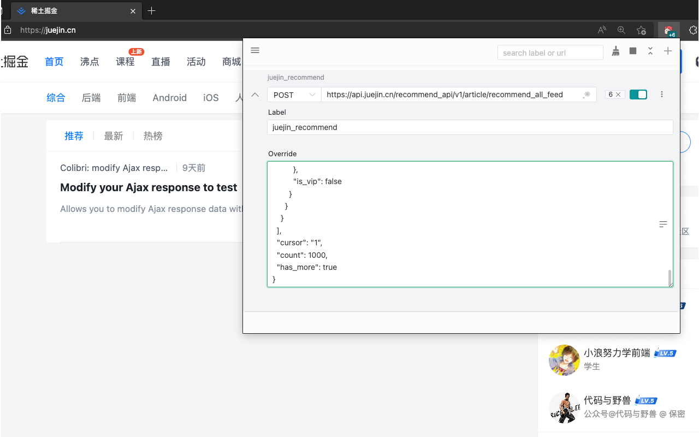

# Colibri

用来修改 Ajax 的响应数据的 Chrome 浏览器插件

参考了很多优秀的开源项目：[devtools](https://github.com/vuejs/devtools)、[ajax-hook](https://github.com/wendux/ajax-hook) 等，UI 风格参考 tweak。

主要技术栈 Vue3 + Tsx + Vite2 + NaiveUI。

此项目仅为学习和我平时工作中使用，目前市场上对于兼容 Manifest V3 版本的相关的问题比较多。如果你有任何关于浏览器插件开发方面的疑惑，并在我这里找到了答案，不胜荣幸！

### 对比 [Ajax Proxy](https://github.com/g0ngjie/ajax-proxy) 差异

|             | Ajax Proxy | Colibri  |
| ----------- | ---------- | -------- |
| 打包体积    | 2.19MB     | 660KB    |
| 生效条件    | 即时响应   | 即时响应 |
| 协议拦截    | 支持       | 支持     |
| 请求重定向  | 支持       | 不支持   |
| 国际化      | 支持       | 不支持   |
| JSON 编辑器 | 支持       | 不支持   |

## Monorepo

| Package                                      | Description                  |
| -------------------------------------------- | ---------------------------- |
| [colibri-lib.v2](./packages/colibri-lib.v2/) | 用于 Ajax 拦截响应的核心逻辑 |
| [shared-utils](./packages/shared-utils/)     | 通用类库                     |
| [shell-chrome](./packages/shell-chrome)      | Chrome/Edge extension        |
| [shell-popup](./packages/shell-popup/)       | 应用操作面板                 |

## 安装

[Chrome 版本](https://chrome.google.com/webstore/detail/colibri-modify-ajax-respo/kalhaoeoppjgmbfdolmoeonfamnddkhc)

[Edge 版本](https://microsoftedge.microsoft.com/addons/detail/colibri-modify-ajax-resp/lfnnioheafobimpkhmdhgjodeobomcfl)

## 注意事项

在使用前如果有同类插件启用，需要提前关闭掉避免冲突。

## License

[MIT](http://opensource.org/licenses/MIT)
